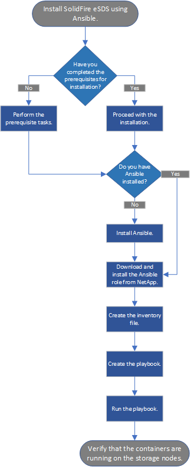

= Introducción a SolidFire Enterprise SDS de NetApp
:allow-uri-read: 
:icons: font
:imagesdir: ../media/

[role="lead"]
SolidFire Enterprise SDS de NetApp (eSDS) proporciona las ventajas de la tecnología de escalado horizontal de SolidFire y de los servicios de datos de software NetApp Element en el hardware de su elección, que cumplen con la configuración de referencia de SolidFire eSDS. ESDS de SolidFire proporciona el software de NetApp Element independientemente del hardware subyacente. Esto permite usar todas las funcionalidades de Element en un dispositivo de la Marca NetApp o en un servidor de uso general, que cumple con la configuración de referencia de NetApp.

== Características principales de SolidFire eSDS

* Permite instalar y ejecutar el software Element mediante contenedores.
* Ofrece funciones y fiabilidad de almacenamiento para empresas mediante plataformas de servidores de consumo validadas previamente. Puede ejecutar cargas de trabajo de producción después de instalar el software SolidFire eSDS en la plataforma de servidor x86 prescrita y los componentes subyacentes (CPU, memoria, unidades SSD, caché, redes firmware), según la configuración de referencia publicada en la https://mysupport.netapp.com/matrix/imt.jsp?components=97283;&solution=1757&isHWU&src=IMT["Herramienta de matriz de interoperabilidad de NetApp (IMT)"].
* Proporciona cifrado de software en reposo. El cifrado por software en reposo permite cifrar todos los datos que se escriben en las unidades SSD de un clúster de almacenamiento. Esto proporciona una capa principal de cifrado en los nodos SolidFire eSDS que no incluyen unidades de cifrado automático (SED).
* Proporciona un rendimiento previsible del clúster mediante políticas de calidad de servicio (QoS).
* Proporciona compatibilidad con clústeres de entre cuatro y 40 nodos.
* Con licencia del modelo de licencia por término capacidad.
* Utiliza un nuevo modelo para proporcionar soporte a través de acuerdos de soporte con partners tecnológicos.

Con eSDS de SolidFire, NetApp proporciona contenedores para elementos que pueden ejecutarse en hardware genérico que cumplan con los requisitos necesarios. Trae tu propio servidor con un sistema operativo ya instalado. Utiliza una herramienta de automatización, como Ansible, para ejecutar la comprobación de cumplimiento previa a la instalación e instalar SolidFire eSDS. Como parte de las tareas de configuración previas a la instalación, debe instalar el nodo de gestión para admitir la recogida de paquetes de registros, así como otros servicios, como AIQ para SolidFire. A continuación se muestra un resumen de la arquitectura que muestra los distintos componentes del entorno de SolidFire eSDS:

image::../media/esds_architecture_overview.png[Muestra una descripción general de la arquitectura del entorno eSDS.]

NOTE: Usted es responsable de configurar, supervisar y administrar el ciclo de vida de la plataforma, así como de configurar las interfaces de red y las tablas de enrutamiento.

Algunas características del software NetApp Element no son aplicables a SolidFire eSDS. Las funciones nativas de Element para los nodos de almacenamiento tradicionales de SolidFire, como la supervisión de hardware, actualizaciones de firmware, cifrado como REST (EAR) con unidades de autocifrado (SED) y Fibre Channel están deshabilitadas para SolidFire eSDS.

* Gestión de claves externas (EKM)
* Cifrado de hardware
* Servicio de segmentos de varias unidades (MDSS)
* Supervisión de hardware, actualizaciones de la plataforma host (por ejemplo: Controladores, firmware y paquetes del sistema operativo) y Fibre Channel

== Información de inicio rápido

Puede encontrar un conjunto condensado de instrucciones para instalar SolidFire eSDS link:../media/SDS_Quick_Start_Guide.pdf["aquí"^].

== Directivas de licencia

SolidFire eSDS está regido por el modelo de licencia de capacidad del plazo de NetApp.

A continuación se ofrece una descripción general de alto nivel de las políticas de este modelo:

* Los costes de software se basan en la capacidad bruta (el tamaño de la unidad multiplicado por el número de unidades en el nodo o clúster), por lo que resulta fácil predecir los costes de software de este modelo.
* No necesita una clave de licencia de software. Recibirá un número de serie maestro para el software en el pedido de venta, que se incluye con el kit de documentos que reciba después de realizar el pedido. Debe conservar este número de serie maestro porque se utilizará para los derechos de soporte.

Para obtener más información, consulte https://www.netapp.com/us/media/sb-4059.pdf["Modelos de compra para NetApp HCI y SolidFire"].

== Interfaces para instalar y utilizar SolidFire eSDS

Aquí tiene una lista de herramientas e interfaces que utiliza para instalar, supervisar y gestionar SolidFire eSDS:

[cols="3*"]
|===
| Herramienta/interfaz | Quién lo utiliza | Descripción 

 a| 
Rol de comprobación de cumplimiento de normativas de Ansible
 a| 
Cliente
 a| 
Para verificar que la plataforma coincide con la configuración de referencia que se muestra en la https://mysupport.netapp.com/matrix/imt.jsp?components=97283;&solution=1757&isHWU&src=IMT["Herramienta de matriz de interoperabilidad de NetApp (se requiere inicio de sesión)"^]. Debe hacerlo antes de instalar SolidFire eSDS.

 a| 
Rol de instalación de Ansible
 a| 
Cliente
 a| 
Para instalar SolidFire eSDS.

 a| 
Nodo de gestión
 a| 
Cliente
 a| 
Para la recogida de paquetes de registros y los servicios de gestión, como AIQ.

 a| 
Control del cloud híbrido de NetApp
 a| 
Cliente, Soporte de NetApp
 a| 
Para la creación de clústeres y la gestión por nodo, así como la recopilación de registros del nodo de gestión.

 a| 
Hewlett Packard Enterprise (HPE) Integrated Lights Out (iLO)
 a| 
Cliente, Soporte de HPE
 a| 
Para recopilar datos sobre eventos y Estados para el análisis de la causa raíz.

 a| 
Dell Integrated Remote Access Controller (iDRAC)
 a| 
Cliente, asistencia de Dell
 a| 
Para recopilar datos sobre eventos y Estados para el análisis de la causa raíz.

 a| 
IU del software de NetApp Element
 a| 
Cliente
 a| 
Para gestionar clústeres de almacenamiento eSDS de SolidFire.

 a| 
Active IQ
 a| 
Cliente, Soporte de NetApp
 a| 
Para la supervisión del estado del clúster.

 a| 
Una recogida
 a| 
Soporte de NetApp
 a| 
Para la recopilación de registros complementarios.

|===

== Información general de la instalación

Puede instalar SolidFire eSDS con una herramienta de automatización como Ansible.

A continuación encontrará información general de alto nivel sobre la instalación con Ansible:

== Clasificación de nodos dinámica

La clasificación dinámica de nodos introducida en Element 12.3.1 le permite aprovechar 24 CPU compatibles por plataforma eSDS en comparación con el modelo actual de una sola CPU por plataforma.

La clasificación dinámica de nodos es compatible con todas las plataformas compatibles actualmente con eSDS: DL360, DL380 y R640.

Para la primera versión de la clasificación de nodos dinámicos, la clasificación máxima de IOPS de cualquier nodo es de 100 000 IOPS.

== Obtenga más información

* https://www.netapp.com/data-storage/solidfire/documentation/["Página de recursos de SolidFire de NetApp"^]
* https://docs.netapp.com/sfe-122/topic/com.netapp.ndc.sfe-vers/GUID-B1944B0E-B335-4E0B-B9F1-E960BF32AE56.html["Documentación para versiones anteriores de SolidFire de NetApp y los productos Element"^]

