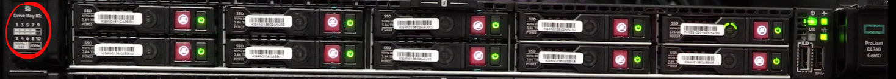

= Reemplace las unidades para HPE DL360
:allow-uri-read: 
:icons: font
:imagesdir: ../media/

[role="lead"]
Elija entre los procedimientos que se enumeran aquí para reemplazar una unidad de manera proactiva, reemplazar una unidad después de fallar y reemplazar una unidad de caché. Reemplazar una unidad de metadatos o una unidad de bloque en el clúster de eSDS de SolidFire. La página UI de Element *Cluster > Drives* muestra la información de desgaste de la unidad.

* <<Sustituya una unidad de forma proactiva>>
* <<Sustituya una unidad defectuosa>>
* <<Sustituya una unidad de caché>>

== Sustituya una unidad de forma proactiva

Realice este procedimiento si desea reemplazar de forma proactiva una unidad de metadatos o una unidad de bloques en el clúster de SolidFire eSDS. La página de interfaz de usuario de Element *Cluster* > *Drives* muestra la información de desgaste de la unidad.

.Lo que necesitará
* En la interfaz de usuario del software NetApp Element, asegúrese de que el clúster esté en buen estado y no haya advertencias ni errores del clúster. Es posible acceder a la interfaz de usuario de Element mediante la dirección IP virtual de gestión (MVIP) del nodo de clúster principal.
* Compruebe que no haya trabajos activos en ejecución en el clúster.
* Asegúrese de que se ha familiarizado con todos los pasos.
* Asegúrese de tomar las precauciones necesarias para evitar descargas electrostáticas (ESD) mientras maneja unidades.

.Pasos
. Realice los siguientes pasos en la interfaz de usuario de Element:
+
.. En la interfaz de usuario de Element, seleccione *Cluster* > *Drives* > *Active*.
.. Seleccione la unidad que desea reemplazar.
.. Anote el número de serie de la unidad. Esto le ayudará a localizar el BayID correspondiente en la interfaz IPMI del nodo (HPE Integrated Lights-Out o iLO, en este caso).
.. Seleccione *acciones masivas* > *Quitar*. Después de extraer la unidad, ésta pasa al estado *Extracción*. Permanece en el estado *Quitar* durante un tiempo, esperando que los datos de la unidad se sincronicen o redistribuyan a las unidades restantes del clúster. Una vez finalizada la extracción, la unidad pasa al estado *disponible*.

. Realice los siguientes pasos para localizar la ranura de unidad de la unidad que se desea reemplazar:
+
.. Inicie sesión en la interfaz IPMI del nodo (iLO en este caso).
.. Seleccione *Información del sistema* en la navegación de la izquierda y, a continuación, seleccione *almacenamiento*.
.. Haga coincidir el número de serie del paso anterior con lo que ve en la pantalla.
.. Busque el número de ranura indicado con el número de serie. Esta es la ranura física desde la que se debe quitar la unidad.

. Ahora que identificó la unidad, quítela de la siguiente manera física:
+
.. Identifique la bahía de unidad.
+
La siguiente imagen muestra la parte frontal del servidor con la numeración de bahías de unidad mostrada en el lado izquierdo de la imagen:

+

.. Pulse el botón de encendido de la unidad que desea reemplazar. El LED parpadea durante 5-10 segundos y se detiene.
.. Cuando el LED deje de parpadear y la unidad esté apagada, retírela del servidor pulsando el botón rojo y tirando del pestillo.
+

NOTE: Asegúrese de manejar las unidades con mucho cuidado.

+
Después de quitar físicamente la unidad, el estado de la unidad cambia a *error* en la interfaz de usuario de Element.

. En la interfaz de usuario de Element, seleccione *Cluster* > *Drives* > *Failed*.
. Seleccione el icono en *acciones* y, a continuación, seleccione *Quitar*.
+
Ahora puede Adelante e instalar la nueva unidad en el nodo.

. Anote el número de serie de la nueva unidad.
. Inserte la unidad de sustitución empujando con cuidado la unidad hacia el compartimento con el pestillo y cerrando el pestillo. La unidad se enciende cuando se inserta correctamente.
. Realice los siguientes pasos para verificar los nuevos detalles de la unidad en iLO:
+
.. Conéctese a la OIT.
.. Seleccione *Información* > *Registro de administración integrado*. Verá un evento registrado en la unidad que agregó.
.. Seleccione *Información del sistema* en la navegación de la izquierda y, a continuación, seleccione *almacenamiento*.
.. Desplácese hasta que encuentre información sobre la bahía en la que reemplazó la unidad.
.. Compruebe que el número de serie de la pantalla coincide con el número de serie de la nueva unidad que ha sustituido.

. Añada la nueva información de la unidad en `sf_sds_config.yaml` archivo del nodo en el que sustituyó la unidad.
+
La `sf_sds_config.yaml` el archivo se almacena en `/opt/sf/`. Este archivo incluye toda la información sobre las unidades del nodo. Cada vez que sustituye una unidad, debe introducir la información de la unidad de reemplazo en este archivo. Para obtener más información acerca de este archivo, consulte link:reference_esds_sf_sds_config_file.html["Contenido del archivo sf_sds_config.yaml"^].

+
.. Establezca una conexión SSH al nodo mediante PuTTY.
.. En la ventana de configuración PuTTY, introduzca la MIP del nodo en el campo *Nombre del host (o dirección IP)*.
.. Seleccione *Abrir*.
.. En la ventana de terminal que se abre, inicie sesión con su nombre de usuario y contraseña.
.. Ejecute el `# cat /opt/sf/sf_sds_config.yaml` para mostrar el contenido del archivo.
.. Reemplace las entradas del `dataDevices` o. `cacheDevices` listas de la unidad que se reemplazó con la información nueva de la unidad.
.. Ejecución `# systemctl start solidfire-update-drives`.
+
Verá el indicador Bash después de que se ejecute este comando. Debe ir a la interfaz de usuario de Element después de esto para añadir la unidad al clúster. La interfaz de usuario de Element muestra una alerta para una nueva unidad disponible.

. Seleccione *Cluster* > *Drives* > *Available*.
+
Puede ver el número de serie de la nueva unidad que ha instalado.

. Seleccione el icono en *acciones* y, a continuación, seleccione *Agregar*.
. Actualice la interfaz de usuario de Element una vez que se complete el trabajo de sincronización de bloques. Verá que la alerta sobre la unidad disponible se ha borrado si accede a la página *tareas en ejecución* desde la ficha *Informes* de la interfaz de usuario de Element.

== Sustituya una unidad defectuosa

Si el clúster de SolidFire eSDS tiene una unidad defectuosa, la interfaz de usuario de Element muestra una alerta. Antes de quitar la unidad del clúster, compruebe el motivo del error. Para ello, consulte la información de la interfaz de IPMI correspondiente al nodo/servidor. Estos pasos son aplicables si va a reemplazar una unidad de bloque o una unidad de metadatos.

.Lo que necesitará
* Desde la interfaz de usuario del software NetApp Element, compruebe que la unidad tenga errores. Element muestra una alerta cuando falla una unidad. Es posible acceder a la interfaz de usuario de Element mediante la dirección IP virtual de gestión (MVIP) del nodo de clúster principal.
* Asegúrese de que se ha familiarizado con todos los pasos.
* Asegúrese de tomar las precauciones necesarias para evitar descargas electrostáticas (ESD) mientras maneja unidades.

.Pasos
. Quite la unidad con error del clúster de la siguiente forma mediante la interfaz de usuario de Element:
+
.. Seleccione *Cluster* > *Drives* > *failed*.
.. Anote el nombre del nodo y el número de serie asociados con la unidad con error.
.. Seleccione el icono en *acciones* y, a continuación, seleccione *Quitar*. Si ve advertencias del servicio asociado con la unidad, espere hasta que se complete la sincronización de bandeja y quite la unidad.

. Realice los siguientes pasos para verificar el fallo de la unidad y ver los eventos registrados asociados con el fallo de la unidad:
+
.. Inicie sesión en la interfaz IPMI del nodo (iLO en este caso).
.. Seleccione *Información* > *Registro de administración integrado*. La razón del fallo de la unidad (por ejemplo, SSDWearOut) y la ubicación se enumeran aquí. También puede ver un evento que indique que el estado de la unidad es degradado.
.. Seleccione *Información del sistema* en la navegación de la izquierda y, a continuación, seleccione *almacenamiento*.
.. Compruebe la información disponible acerca de la unidad con error. El estado de la unidad con error dirá *degradado*.

. Quite la unidad físicamente de la siguiente manera:
+
.. Identifique el número de ranura de la unidad en el chasis.
+
La siguiente imagen muestra la parte frontal del servidor con la numeración de bahías de unidad mostrada en el lado izquierdo de la imagen:

+

.. Pulse el botón de encendido de la unidad que desea reemplazar. El LED parpadea durante 5-10 segundos y se detiene.
.. Cuando el LED deje de parpadear y la unidad esté apagada, retírela del servidor pulsando el botón rojo y tirando del pestillo.
+

NOTE: Asegúrese de manejar las unidades con mucho cuidado.

. Inserte la unidad de sustitución empujando con cuidado la unidad hacia el compartimento con el pestillo y cerrando el pestillo. La unidad se enciende cuando se inserta correctamente.
. Verifique los nuevos detalles del accionamiento en iLO:
+
.. Seleccione *Información* > *Registro de administración integrado*. Verá un evento registrado en la unidad que añadió.
.. Actualice la página para ver los eventos registrados para la unidad nueva que añadió.

. Compruebe el estado de su sistema de almacenamiento en iLO:
+
.. Seleccione *Información del sistema* en la navegación de la izquierda y, a continuación, seleccione *almacenamiento*.
.. Desplácese hasta que encuentre información sobre el compartimiento en el que instaló la nueva unidad.
.. Anote el número de serie.

. Añada la nueva información de la unidad en `sf_sds_config.yaml` archivo del nodo en el que sustituyó la unidad.
+
La `sf_sds_config.yaml` el archivo se almacena en `/opt/sf/`. Este archivo incluye toda la información sobre las unidades del nodo. Cada vez que sustituye una unidad, debe introducir la información de la unidad de reemplazo en este archivo. Para obtener más información acerca de este archivo, consulte link:reference_esds_sf_sds_config_file.html["Contenido del archivo sf_sds_config.yaml"^].

+
.. Establezca una conexión SSH al nodo mediante PuTTY.
.. En la ventana de configuración PuTTY, introduzca la MIP del nodo en el campo *Nombre del host (o dirección IP)*.
.. Seleccione *Abrir*.
.. En la ventana de terminal que se abre, inicie sesión con su nombre de usuario y contraseña.
.. Ejecute el `# cat /opt/sf/sf_sds_config.yaml` para mostrar el contenido del archivo.
.. Reemplace las entradas del `dataDevices` o. `cacheDevices` listas de la unidad que se reemplazó con la información nueva de la unidad.
.. Ejecución `# systemctl start solidfire-update-drives`.
+
Verá el indicador Bash después de que se ejecute este comando. Debe ir a la interfaz de usuario de Element después de esto para añadir la unidad al clúster. La interfaz de usuario de Element muestra una alerta para una nueva unidad disponible.

. Seleccione *Cluster* > *Drives* > *Available*.
+
Puede ver el número de serie de la nueva unidad que ha instalado.

. Seleccione el icono en *acciones* y, a continuación, seleccione *Agregar*.
. Actualice la interfaz de usuario de Element una vez que se complete el trabajo de sincronización de bloques. Verá que la alerta sobre la unidad disponible se ha borrado si accede a la página *tareas en ejecución* desde la ficha *Informes* de la interfaz de usuario de Element.

== Sustituya una unidad de caché

Realice este procedimiento si desea sustituir la unidad de caché en el clúster de SolidFire eSDS. La unidad de caché está asociada con los servicios de metadatos. La página de interfaz de usuario de Element *Cluster* > *Drives* muestra la información de desgaste de la unidad.

.Lo que necesitará
* En la interfaz de usuario del software NetApp Element, asegúrese de que el clúster esté en buen estado y no haya advertencias ni errores del clúster. Es posible acceder a la interfaz de usuario de Element mediante la dirección IP virtual de gestión (MVIP) del nodo de clúster principal.
* Compruebe que no haya trabajos activos en ejecución en el clúster.
* Asegúrese de que se ha familiarizado con todos los pasos.
* Asegúrese de quitar los servicios de metadatos de la interfaz de usuario de Element.
* Asegúrese de tomar las precauciones necesarias para evitar descargas electrostáticas (ESD) mientras maneja unidades.

.Pasos
. Realice los siguientes pasos en la interfaz de usuario de Element:
+
.. En la interfaz de usuario de Element, seleccione *Cluster* > *Nodes* > *Active*.
.. Anote el ID de nodo y la dirección IP de gestión del nodo en el que desea sustituir la unidad de caché.
.. Si la unidad de caché está en buen estado y la va a reemplazar de forma proactiva, seleccione *Active Drives*, localice la unidad de metadatos y elimínela de la interfaz de usuario.
+
Después de eliminarlo, la unidad de metadatos pasa a *Estado de extracción* primero y a *disponible*.

.. Si está realizando la sustitución después de que la unidad de caché falló, la unidad de metadatos estará en el estado *disponible*, y aparecerá en *Cluster* > *Drives* > *disponible*.
.. En la interfaz de usuario de Element, seleccione *Cluster* > *Drives* > *Active*.
.. Seleccione la unidad de metadatos asociada con NodeName donde desea reemplazar la unidad de caché.
.. Seleccione *acciones masivas* > *Quitar*. Después de extraer la unidad, ésta pasa al estado *Extracción*. Permanece en el estado *Quitar* durante un tiempo, esperando que los datos de la unidad se sincronicen o redistribuyan a las unidades restantes del clúster. Una vez finalizada la extracción, la unidad pasa al estado *disponible*.

. Realice los siguientes pasos para localizar la ranura de unidad de la unidad de caché que se desea reemplazar:
+
.. Inicie sesión en la interfaz IPMI del nodo (iLO en este caso).
.. Seleccione *Información del sistema* en la navegación de la izquierda y, a continuación, seleccione *almacenamiento*.
.. Busque la unidad de caché.
+

NOTE: Las unidades de caché tienen una capacidad menor que las unidades de almacenamiento.

.. Busque el número de ranura indicado para la unidad de caché. Esta es la ranura física desde la que se debe quitar la unidad.

. Ahora que identificó la unidad, quítela de la siguiente manera física:
+
.. Identifique la bahía de unidad.
+
La siguiente imagen muestra la parte frontal del servidor con la numeración de bahías de unidad mostrada en el lado izquierdo de la imagen:

+

.. Pulse el botón de encendido de la unidad que desea reemplazar. El LED parpadea durante 5-10 segundos y se detiene.
.. Cuando el LED deje de parpadear y la unidad esté apagada, retírela del servidor pulsando el botón rojo y tirando del pestillo.
+

NOTE: Asegúrese de manejar las unidades con mucho cuidado.

+
Después de quitar físicamente la unidad, el estado de la unidad cambia a *error* en la interfaz de usuario de Element.

. Anote el número de modelo de HPE y el ISN (número de serie) de la nueva unidad de caché.
. Inserte la unidad de sustitución empujando con cuidado la unidad hacia el compartimento con el pestillo y cerrando el pestillo. La unidad se enciende cuando se inserta correctamente.
. Realice los siguientes pasos para verificar los nuevos detalles de la unidad en iLO:
+
.. Conéctese a la OIT.
.. Seleccione *Información* > *Registro de administración integrado*. Verá un evento registrado en la unidad que añadió.
.. Seleccione *Información del sistema* en la navegación de la izquierda y, a continuación, seleccione *almacenamiento*.
.. Desplácese hasta que encuentre información sobre la bahía en la que reemplazó la unidad.
.. Compruebe que el número de serie de la pantalla coincide con el número de serie de la nueva unidad que ha instalado.

. Añada la nueva información de la unidad de la caché en `sf_sds_config.yaml` archivo del nodo en el que sustituyó la unidad.
+
La `sf_sds_config.yaml` el archivo se almacena en `/opt/sf/`. Este archivo incluye toda la información sobre las unidades del nodo. Cada vez que sustituye una unidad, debe introducir la información de la unidad de reemplazo en este archivo. Para obtener más información acerca de este archivo, consulte link:reference_esds_sf_sds_config_file.html["Contenido del archivo sf_sds_config.yaml"^].

+
.. Establezca una conexión SSH al nodo mediante PuTTY.
.. En la ventana de configuración PuTTY, introduzca la dirección MIP del nodo (de la que hizo una nota desde la interfaz de usuario del elemento anteriormente) en el campo *Nombre de host (o dirección IP)*.
.. Seleccione *Abrir*.
.. En la ventana de terminal que se abre, inicie sesión con su nombre de usuario y contraseña.
.. Ejecute el `nvme list` Comando para mostrar los dispositivos NMVe.
+
Es posible ver el número de modelo y el número de serie de la nueva unidad de caché. Consulte la siguiente salida de ejemplo:

+
image::../media/esds_nvme_list.png[Muestra el número de modelo y el número de serie de la nueva unidad de caché.]

.. Añada la nueva información de la unidad de la caché en `/opt/sf/sf_sds_config.yaml`.
+
Debe reemplazar el número de modelo y el número de serie de la unidad de caché existentes por la información correspondiente de la nueva unidad de caché. Consulte el siguiente ejemplo:

+
image::../media/esds_cache_drive_info.png[Muestra el número de modelo y el número de serie.]

.. Guarde la `/opt/sf/sf_sds_config.yaml` archivo.

. Realice los pasos de la situación que le corresponda:
+
[cols="2*"]
|===
| Situación | Pasos 

| La nueva unidad de caché insertada aparece después de ejecutar el `nvme list` comando  a| 
.. Ejecución `# systemctl restart solidfire`. Esto tarda unos tres minutos.
.. Compruebe la `solidfire` estado mediante la ejecución `system status solidfire`.
.. Vaya al paso 9.

| La nueva unidad de caché insertada no aparece después de ejecutar el `nvme list` comando  a| 
.. Reiniciar el nodo.
.. Cuando se reinicie el nodo, compruebe que `solidfire` Los servicios se están ejecutando iniciando sesión en el nodo (mediante PuTTY) y ejecutando el `system status solidfire` comando.
.. Vaya al paso 9.

|===
+

NOTE: Reiniciando `solidfire` o reiniciar el nodo provoca algunos fallos del clúster, que finalmente se borran en unos cinco minutos.

. En la interfaz de usuario de Element, vuelva a añadir la unidad de metadatos que quitó:
+
.. Seleccione *Cluster* > *Drives* > *Available*.
.. Seleccione el icono en acciones y seleccione *Agregar*.

. Actualice la interfaz de usuario de Element una vez que se complete el trabajo de sincronización de bloques.
+
Puede ver que la alerta sobre la unidad disponible se ha borrado junto con otros errores del clúster.

== Obtenga más información

* https://www.netapp.com/data-storage/solidfire/documentation/["Página de recursos de SolidFire de NetApp"^]
* https://docs.netapp.com/sfe-122/topic/com.netapp.ndc.sfe-vers/GUID-B1944B0E-B335-4E0B-B9F1-E960BF32AE56.html["Documentación para versiones anteriores de SolidFire de NetApp y los productos Element"^]

