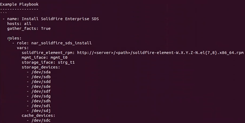

= Instale SolidFire eSDS con Ansible
:allow-uri-read: 
:icons: font
:imagesdir: ../media/

[role="lead"]
Puede instalar SolidFire eSDS con una herramienta de automatización como Ansible. Si está muy familiarizado con Ansible, puede crear un libro de estrategia de Ansible que combine varias tareas, como instalar SolidFire eSDS y crear un clúster.

.Lo que necesitará
* Ha instalado Ansible en el servidor local siguiendo las instrucciones proporcionadas https://docs.ansible.com/ansible/latest/installation_guide/intro_installation.html#installation-guide["aquí"^].
* Se ha familiarizado con las funciones de Ansible. Consulte https://docs.ansible.com/ansible/latest/user_guide/playbooks_reuse_roles.html["aquí"^].
* Ha realizado todas las tareas de requisitos previos enumeradas link:concept_esds_prerequisite_tasks.html["aquí"^].
* Ha ejecutado una comprobación de cumplimiento de SolidFire eSDS. Para obtener instrucciones sobre cómo ejecutar la comprobación de cumplimiento, consulte link:concept_esds_prerequisite_tasks.html["aquí"^].

.Acerca de esta tarea
Utilice Ansible Vault para obtener información confidencial, como contraseñas, en lugar de usar texto sin formato. Para más información, consulte los siguientes enlaces:

* https://docs.ansible.com/ansible/latest/user_guide/playbooks_vault.html["Con Ansible Vault"^]
* https://docs.ansible.com/ansible/latest/user_guide/intro_inventory.html["Cómo construir su inventario"^]

IMPORTANT: Debe especificar todas las variables necesarias en el archivo de inventario y no en el libro de estrategia.

.Pasos
. Ejecute el `ansible-galaxy install` para instalar el `nar_solidfire_sds_install` función.
+
[listing]
----
ansible-galaxy install git+https://github.com/NetApp-Automation/nar_solidfire_sds_install.git
----
+
También puede instalar manualmente la función copiándola de https://github.com/NetApp-Automation["Repositorio de GitHub de NetApp"^] y colocar el rol en el `~/.ansible/roles` directorio. NetApp proporciona un archivo README que incluye información acerca de cómo ejecutar una función.

+

NOTE: Asegúrese de descargar siempre las versiones más recientes de las funciones.

. Mueva los roles que descargó hacia arriba en un directorio desde el lugar donde se instalaron.
+
[listing]
----
 $ mv ~/.ansible/roles/ansible/nar_solidfire_sds_* ~/.ansible/roles/
----
. Ejecute el `ansible-galaxy role list` Comando para garantizar que Ansible está configurado para utilizar los roles nuevos.
+
[listing]
----
 $ ansible-galaxy role list
 # ~/.ansible/roles
 - nar_solidfire_sds_install, (unknown version)
 - nar_solidfire_sds_upgrade, (unknown version)
 - ansible, (unknown version)
 - nar_solidfire_sds_compliance, (unknown version)
 - nar_solidfire_cluster_config, (unknown version)
 - nar_solidfire_sds_uninstall, (unknown version)
----
+

NOTE: El archivo README asociado a roles incluye una lista de todas las variables necesarias y opcionales que debe definir como se muestra a continuación:

+

+
Debe definir estas variables en el archivo de inventario, que creará en el paso siguiente.

. Cree el archivo de inventario en el directorio de trabajo de Ansible.
+

TIP: En el archivo de inventario, debe incluir todos los hosts (nodos) en los que desea instalar SolidFire eSDS. El archivo de inventario permite al libro de estrategia (que se creará en el siguiente paso) administrar varios hosts con un solo comando. También se deben definir variables, como nombre de usuario y contraseña para los nodos de almacenamiento, nombres de la interfaz de gestión y de la interfaz de almacenamiento, etc.

+
[IMPORTANT]
====
Asegúrese de seguir estas directrices para el archivo de inventario: ** Utilice las ortografía correctas para los nombres de dispositivos. ** Utilice el formato correcto en el archivo. ** Asegúrese de que sólo hay un dispositivo de almacenamiento en caché. ** Utilice una lista para especificar Storage_devices.

====
+

NOTE: Los ejemplos que se proporcionan aquí tienen los nombres de las interfaces de almacenamiento y gestión para los servidores HPE. Si tiene un servidor Dell, el nombre del dispositivo de caché es nvme1n1. En el caso de los servidores Dell, mgmt_iface es team1G y Storage_iface es team10G.

+
A continuación se muestra un archivo de inventario de ejemplo. Incluye cuatro nodos de almacenamiento. En este ejemplo, reemplace *MIP* del nodo de almacenamiento con las direcciones MIP de los nodos de almacenamiento y reemplace ***** con el nombre de usuario y la contraseña para los nodos de almacenamiento.

+
[listing]
----
all:
    hosts:
        storage node MIP:
        storage node MIP:
        storage node MIP:
        storage node MIP:
    vars:
        ansible_connection: ssh
        ansible_ssh_common_args: -o StrictHostKeyChecking=no
        ansible_user: *****
        ansible_ssh_pass: *****
        solidfire_element_rpm: http://sf-artifactory.solidfire.net/artifactory/crux/solidfire-element-**.*.*.***-*.***.x86_64.rpm
        mgmt_iface: "team0"
        storage_iface: "team1"
        storage_devices:
          - "/dev/nvme0n1"
          - "/dev/nvme1n1"
          - "/dev/nvme2n1"
          - "/dev/nvme3n1"
          - "/dev/nvme4n1"
          - "/dev/nvme5n1"
          - "/dev/nvme6n1"
          - "/dev/nvme7n1"
          - "/dev/nvme8n1"
        cache_devices:
          - "/dev/nvme9n1"
----
. Haga ping a los hosts (nodos) definidos en el archivo de inventario para verificar que Ansible pueda comunicarse con ellos.
. Descargue el archivo Red Hat Package Manager (RPM) en el directorio de archivos de un servidor web local al que se puede acceder desde el servidor que ejecuta Ansible y los nodos de almacenamiento.
. Cree el libro de estrategia de Ansible. Si ya dispone de un libro de aplicaciones, puede modificarlo. Puede utilizar los ejemplos del archivo README que proporciona NetApp.
. Instale SolidFire eSDS ejecutando el libro de estrategia que creó en el paso anterior:
+
[listing]
----
 $ ansible-playbook -i inventory.yaml sample_playbook.yaml
----
+
Sustituya *sample_playbook.yaml* por el nombre de su libro de estrategia y *Inventory.yaml* por el nombre de su archivo de inventario. Al ejecutar el libro de estrategia se crea el `sf_sds_config.yaml` archivo de cada nodo que aparece en el archivo de inventario. También instala e inicia el servicio SolidFire en cada nodo de almacenamiento. Para obtener más información acerca de `sf_sds_config.yaml`, consulte link:reference_esds_sf_sds_config_file.html["aquí"^].

. Compruebe la salida de Ansible en la consola para garantizar que el servicio SolidFire se haya iniciado en cada nodo.
+
A continuación se muestra una salida de ejemplo:

+
[listing]
----

TASK [nar_solidfire_sds_install : Ensure the SolidFire eSDS service is started] *********************************************************************************************

changed: [10.61.68.52]

changed: [10.61.68.54]

changed: [10.61.68.51]

changed: [10.61.68.53]

PLAY RECAP ******************************************************************************************************************************************************************

10.61.68.51                : ok=12   changed=3    unreachable=0
failed=0    skipped=10   rescued=0    ignored=0

10.61.68.52                : ok=12   changed=3    unreachable=0
failed=0    skipped=10   rescued=0    ignored=0

10.61.68.53                : ok=12   changed=3    unreachable=0
failed=0    skipped=10   rescued=0    ignored=0

10.61.68.54                : ok=12   changed=3    unreachable=0
failed=0    skipped=10   rescued=0    ignored=0
----
. Para verificar que el servicio SolidFire se ha iniciado correctamente, ejecute el `systemctl status solidfire` y comprobar `Active:active (exited)...` en el resultado.

== Obtenga más información

* https://www.netapp.com/data-storage/solidfire/documentation/["Página de recursos de SolidFire de NetApp"^]
* https://docs.netapp.com/sfe-122/topic/com.netapp.ndc.sfe-vers/GUID-B1944B0E-B335-4E0B-B9F1-E960BF32AE56.html["Documentación para versiones anteriores de SolidFire de NetApp y los productos Element"^]

