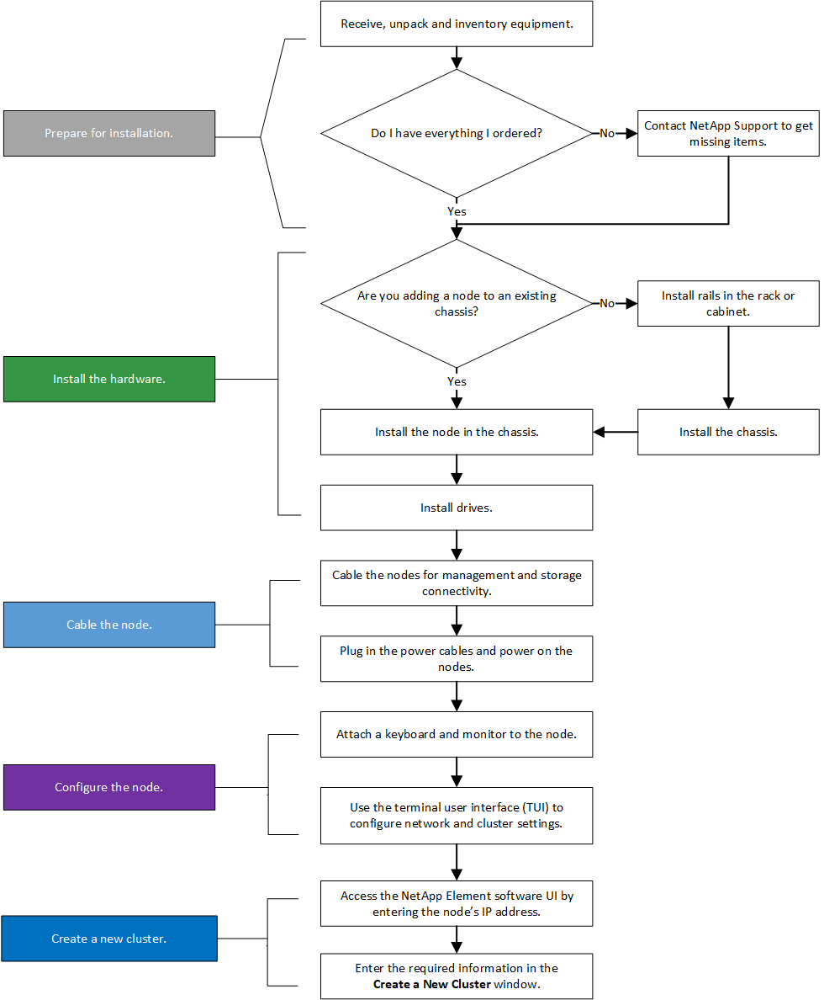
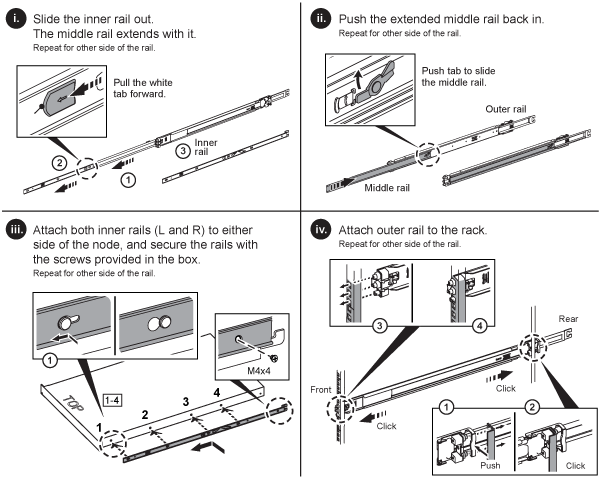

= Instale los nodos de almacenamiento H-Series
:allow-uri-read: 
:icons: font
:imagesdir: ../media/

[role="lead"]
Antes de empezar a utilizar su sistema de almacenamiento all-flash, debe instalar y configurar los nodos de almacenamiento correctamente.

TIP: Consulte link:../media/hseries_isi.pdf["cartel"^] para una representación visual de las instrucciones.

* <<Diagramas de flujo de trabajo>>
* <<Preparación de la instalación>>
* <<Instale los rieles>>
* <<Instale los nodos y cablee>>
* <<Configure los nodos>>
* <<Cree un clúster>>

== Diagramas de flujo de trabajo

Los diagramas de flujo de trabajo aquí proporcionan una descripción general de alto nivel de los pasos de la instalación. Los pasos varían ligeramente según el modelo de la serie H.

=== H410S

=== H610S

NOTE: Los términos "nodo" y "chasis" se usan indistintamente en el caso de H610S, ya que el nodo y el chasis no son componentes separados a diferencia de lo que sucede en el caso de un chasis 2U de cuatro nodos.

image::../media/h610s_isi_workflow.png[Flujo de trabajo de instalación H610S]

== Preparación de la instalación

Durante la preparación para la instalación, realice el inventario del hardware que recibió y póngase en contacto con el soporte de NetApp en caso de que falte algún artículo.

Asegúrese de tener los siguientes elementos en su ubicación de instalación:

* Espacio en rack para el sistema.

[cols="2*"]
|===
| Tipo de nodo | Espacio de rack 

| Nodos H410S | Dos unidades de rack (2U) 

| Nodos H610S | Una unidad de rack (1U) 
|===
* Cables o transceptores de conexión directa SFP28/SFP+
* Cables CAT5e o superiores con conector RJ45
* Un switch de teclado, vídeo y ratón (KVM) para configurar el sistema
* Stick USB (opcional)

TIP: El hardware que se le envía depende de lo que realice su pedido. Un nuevo pedido de 2U de cuatro nodos incluye el chasis, el panel frontal, el kit de rieles deslizantes, unidades, nodos de almacenamiento, y los cables de alimentación (dos por chasis). Si solicita nodos de almacenamiento H610S, las unidades se instalan en el chasis.

CAUTION: Durante la instalación de la tornillería, asegúrese de retirar todo el material de embalaje y el embalaje de la unidad. Esto evitará que los nodos se sobrecalienten y se apaguen.

== Instale los rieles

El orden de hardware que se le envió incluye un conjunto de rieles deslizantes. Necesitará un destornillador para completar la instalación del riel. Los pasos de instalación varían ligeramente para cada modelo de nodo.

TIP: Instale la tornillería desde la parte inferior del bastidor hasta la parte superior para evitar que el equipo se caiga. Si el rack incluye dispositivos estabilizadores, instálelos antes de instalar el hardware.

* <<H410S>>
* <<H610S>>

=== H410S

Los nodos H410S se instalan en chasis 2U de cuatro nodos H-Series, que se envía con dos conjuntos de adaptadores. Si desea instalar el chasis en un rack con orificios redondos, utilice los adaptadores adecuados para un rack con orificios redondos. Los rieles para nodos H410S colocan un rack de entre 29 pulgadas y 33.5 pulgadas de profundidad. Cuando el riel está totalmente contrapuesto, tiene 28 pulgadas de largo, y las secciones delantera y trasera del riel se mantienen Unidas sólo con un tornillo.

CAUTION: Si instala el chasis en un riel totalmente contratado, es posible que las secciones delantera y trasera del riel se separen.

.Pasos
. Alinee la parte frontal del raíl con los orificios del poste delantero del rack.
. Empuje los ganchos de la parte frontal del raíl hacia los orificios del poste delantero del rack y, a continuación, hacia abajo hasta que las clavijas cargadas por resorte encajen en los orificios del rack.
. Fije el riel al rack con tornillos. A continuación, se muestra una ilustración del raíl izquierdo conectado a la parte frontal del rack:
+
image::../media/h410s_rail.gif[Instalación de rieles para 2U]

. Extienda la sección trasera del raíl al poste trasero del bastidor.
. Alinee los ganchos de la parte trasera del raíl con los orificios adecuados del poste trasero, asegurándose de que la parte delantera y posterior del raíl estén al mismo nivel.
. Monte la parte posterior del raíl en el rack y fije el riel con tornillos.
. Realice todos los pasos anteriores para el otro lado del rack.

=== H610S

A continuación encontrará una ilustración de la instalación de rieles para un nodo de almacenamiento H610S:

TIP: Hay rieles izquierdo y derecho en la H610S. Coloque el orificio roscado hacia la parte inferior de manera que el tornillo de mariposa H610S pueda fijar el chasis al raíl.

== Instale los nodos y cablee

Debe instalar el nodo de almacenamiento H410S en un chasis 2U de cuatro nodos. Para H610S, instale el chasis/nodo directamente en los rieles del rack.

CAUTION: Retire todo el material de embalaje y el embalaje de la unidad. Esto evita que los nodos se sobrecalienten y se apaguen.

* <<H410S>>
* <<H610S>>

=== H410S

.Pasos
. Instale los nodos H410S en el chasis. A continuación, se muestra un ejemplo de vista posterior de un chasis con cuatro nodos instalados:
+
image::../media/sf_isi_chassis_rear.png[En esta figura se muestra la parte posterior de un 2U]

+

WARNING: Sea cauteloso al levantar el hardware e instalarlo en el rack. Un chasis vacío de dos unidades en rack (2U) de cuatro nodos pesa 54.45 lb (24.7 kg) y un nodo pesa 8.0 lb (3.6 kg).

. Instale las unidades.
+
image::../media/hci_stor_node_ssd_bays.gif[En esta figura se muestra el frente del 2U]

. Cablee los nodos.
+

IMPORTANT: Si la apertura de flujo de aire de la parte trasera del chasis está bloqueada con cables o etiquetas, puede provocar fallos prematuros en los componentes debido al sobrecalentamiento.

+
image::../media/hci_isi_storage_cabling.png[En esta figura, se muestra el cableado de un nodo de almacenamiento H410S.]

+
** Conecte dos cables CAT5e o superiores en los puertos A y B para conectividad de gestión.
** Conecte dos cables o transceptores SFP28/SFP+ en los puertos C y D para conectividad de almacenamiento.
** (Opcional, recomendado) Conecte un cableCAT5e en el puerto IPMI para conectividad de gestión fuera de banda.

. Conecte los cables de alimentación a las dos unidades de suministro de alimentación por chasis y enchúfelos en un PDU o tomacorriente de 240 V.
. Encienda los nodos.
+

NOTE: El nodo tarda aproximadamente seis minutos en arrancar.

+
image::../media/hci_poweron_isg.gif[En esta figura, se muestran los botones de encendido en los nodos en 2U]

=== H610S

.Pasos
. Instale el chasis H610S. A continuación se muestra una ilustración de la instalación del nodo/chasis en el rack:
+
image::../media/h610s_chassis_isi.gif[Muestra el nodo/chasis H610S que se está instalando en el rack.]

+

WARNING: Sea cauteloso al levantar el hardware e instalarlo en el rack. Un chasis H610S pesa 40.5 lb (18.4 kg).

. Cablee los nodos.
+

IMPORTANT: Si la apertura de flujo de aire de la parte trasera del chasis está bloqueada con cables o etiquetas, puede provocar fallos prematuros en los componentes debido al sobrecalentamiento.

+
image::../media/h600s_isi_noderear.png[En esta figura, se muestra el cableado del nodo de almacenamiento H610S.]

+
** Conecte el nodo a una red de 10 GbE mediante dos cables SFP28 o SFP+.
** Conecte el nodo a una red de 1 GbE mediante dos conectores RJ45.
** Conecte el nodo a una red de 1 GbE mediante un conector RJ-45 en el puerto IPMI.
** Conecte ambos cables de alimentación al nodo.

. Encienda los nodos.
+

NOTE: El nodo tarda aproximadamente cinco minutos y 30 segundos en arrancar.

+
image::../media/h600s_isi_nodefront.png[Esta figura muestra el frente del chasis H610S con el botón de encendido resaltado.]

== Configure los nodos

Después de montar en rack y cablear el hardware, está listo para configurar el nuevo recurso de almacenamiento.

.Pasos
. Conecte un teclado y un monitor al nodo.
. En la interfaz de usuario de terminal (TUI) que se muestra, configure la red y la configuración del clúster del nodo con la navegación en pantalla.
+

NOTE: Debe obtener la dirección IP del nodo de la TUI. Lo necesita cuando añade el nodo a un clúster. Después de guardar la configuración, el nodo está en estado pendiente y se puede añadir a un clúster. Consulte la <insert link to Setup section>.

. Configurar la administración fuera de banda mediante el controlador de administración de la placa base (BMC). Estos pasos se aplican *sólo a los nodos H610S*.
+
.. Utilice un explorador Web y navegue hasta la dirección IP predeterminada del BMC: 192.168.0.120
.. Inicie sesión utilizando *root* como nombre de usuario y *calvin* como contraseña.
.. Desde la pantalla de administración de nodos, vaya a *Configuración* > *Configuración de red* y configure los parámetros de red para el puerto de administración fuera de banda.

TIP: Consulte https://kb.netapp.com/Advice_and_Troubleshooting/Hybrid_Cloud_Infrastructure/NetApp_HCI/How_to_access_BMC_and_change_IP_address_on_H610S["Este artículo de base de conocimientos (es necesario iniciar sesión)"].

== Cree un clúster

Después de añadir el nodo de almacenamiento a la instalación y de configurar el nuevo recurso de almacenamiento, estará listo para crear un nuevo clúster de almacenamiento

.Pasos
. Desde un cliente en la misma red que el nodo recién configurado, acceda a la interfaz de usuario del software NetApp Element introduciendo la dirección IP del nodo.
. Introduzca la información necesaria en la ventana **Crear un nuevo clúster**. Consulte link:../setup/concept_setup_overview.html["información general de la configuración"^] si quiere más información.

== Obtenga más información

* https://docs.netapp.com/us-en/element-software/index.html["Documentación de SolidFire y el software Element"]
* https://docs.netapp.com/sfe-122/topic/com.netapp.ndc.sfe-vers/GUID-B1944B0E-B335-4E0B-B9F1-E960BF32AE56.html["Documentación para versiones anteriores de SolidFire de NetApp y los productos Element"^]

