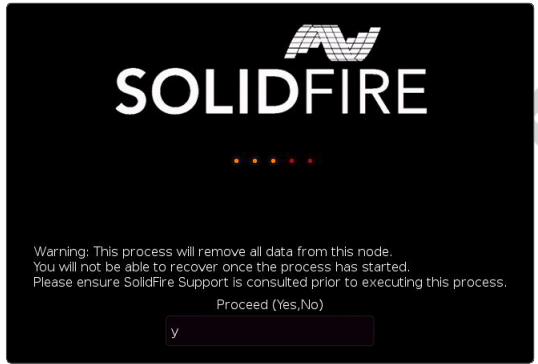

= El proceso RTFI
:allow-uri-read: 
:icons: font
:imagesdir: ../media/

[role="lead"]
Puede comenzar el proceso Volver a la imagen de fábrica (RTFI) interactuando con el nodo a través de las indicaciones de la consola de texto que aparecen antes de que arranque el sistema.

WARNING: El proceso RTFI es destructivo para los datos y borra todos los datos y detalles de configuración del nodo de forma segura e instala un nuevo sistema operativo. Compruebe que el nodo utilizado para el proceso RTFI no está activo como parte de un clúster.

El proceso RTFI realiza las siguientes operaciones de alto nivel:

. Inicia la instalación tras la confirmación del usuario y valida la imagen.
. Desbloquea todas las unidades de un nodo.
. Valida y parpadea el firmware.
. Comprueba la tornillería.
. Prueba hardware.
. Secure borra todas las unidades seleccionadas.
. Crea particiones en la unidad raíz y crea sistemas de archivos.
. Monta y descomprime la imagen.
. Configura el nombre del host, la red (Protocolo de configuración dinámica de host), la configuración de clúster predeterminada y el gestor de arranque de GRUB.
. Detiene todos los servicios, recopila registros y reinicia.

Para configurar el nodo una vez finalizado correctamente el proceso de RTFI, consulte https://docs.netapp.com/us-en/element-software/index.html["Documentación para la versión del software Element"^]. Una vez que un nodo finaliza correctamente el proceso RTFI, pasa al estado _Available_ (sin configurar) de forma predeterminada.

== Realice el proceso RTFI

Utilice el siguiente procedimiento para restaurar el software Element en su nodo SolidFire.

Para obtener información sobre cómo crear una clave USB o utilizar el BMC para realizar el proceso RTFI, consulte xref:task_rtfi_deployment_and_install_options.adoc[Opciones de implementación e instalación de RTFI].

.Antes de empezar
Compruebe que cumple los siguientes requisitos:

* Tiene acceso a una consola para el nodo SolidFire.
* El nodo en el que está realizando el proceso RTFI se enciende y se conecta a una red.
* El nodo en el que está realizando el proceso RTFI no forma parte de un clúster activo.
* Tiene acceso a medios de instalación de inicio que contienen la imagen de la versión de software Element correspondiente para la configuración.

Póngase en contacto con el soporte de NetApp si tiene alguna duda antes de realizar el proceso RTFI.

.Pasos
. Conecte un monitor y un teclado a la parte posterior del nodo, o conecte a la interfaz de usuario de IP de BMC, y active la consola *iKVM/HTML5* desde la ficha *Control remoto* de la interfaz de usuario.
. Inserte una llave USB con la imagen adecuada en una de las dos ranuras USB de la parte posterior del nodo.
. Encienda o restablezca el nodo. Durante el arranque, seleccione dispositivo de arranque seleccionando *F11*:
+

NOTE: Debe seleccionar *F11* varias veces en sucesión rápida porque la pantalla Boot Device (dispositivo de inicio) va rápidamente.

. En el menú de selección Boot Device (dispositivo de inicio), resalte la opción USB (USB).
+
Las opciones que aparecen dependen de la Marca USB que esté utilizando.

+
[NOTE]
====
Si no aparece ningún dispositivo USB en la lista, vaya al BIOS, compruebe que el USB aparece en el orden de inicio, reinicie y vuelva a intentarlo.

Si eso no resuelve el problema, vaya al BIOS, vaya a la ficha *Guardar y salir*, seleccione *Restaurar valores predeterminados optimizados*, acepte y guarde la configuración y reinicie.

====
. Aparece una lista de las imágenes que se encuentran en el dispositivo USB resaltado. Seleccione la versión deseada y seleccione ENTER para iniciar el proceso RTFI.
+
Aparece el nombre y número de versión del software del elemento de imagen de RTFI.

. En la solicitud inicial, se le notifica que el proceso eliminará todos los datos del nodo y que los datos no se podrán recuperar una vez que se inicie el proceso. Introduzca *Sí* para comenzar.
+

WARNING: Una vez iniciado el proceso, todos los datos y detalles de configuración se borran de forma permanente del nodo. Si opta por no continuar, se le dirigirá al xref:task_rtfi_options_menu.html[Menú de opciones de RTFI].

+

NOTE: Si desea ver la consola durante el proceso de RTFI, puede presionar las teclas *ALT+F8* para cambiar a la consola de modo detallado. Presione *ALT+F7* para volver a la GUI principal.

. Introduzca *no* cuando se le solicite que realice amplias pruebas de hardware a menos que tenga un motivo para sospechar que se trata de un error de hardware o que le indique que realice las pruebas realizadas por el soporte de NetApp.
+
Un mensaje indica que el proceso RTFI ha finalizado y que el sistema se apaga.

. Si es necesario, quite todos los medios de instalación de arranque después de que el nodo se apague.
+
El nodo ahora está listo para estar encendido y configurado. Consulte https://docs.netapp.com/us-en/element-software/setup/concept_setup_overview.html["El software Element configura la documentación de almacenamiento"^] para configurar el nodo de almacenamiento.

+
Si ha encontrado un mensaje de error durante el proceso de RTFI, consulte xref:task_rtfi_options_menu.html[Menú de opciones de RTFI].

== Obtenga más información

* https://docs.netapp.com/us-en/element-software/index.html["Documentación de SolidFire y el software Element"]
* https://docs.netapp.com/sfe-122/topic/com.netapp.ndc.sfe-vers/GUID-B1944B0E-B335-4E0B-B9F1-E960BF32AE56.html["Documentación para versiones anteriores de SolidFire de NetApp y los productos Element"^]

