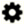
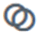
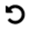

= Iconos en la interfaz de Element
:allow-uri-read: 
:icons: font
:imagesdir: ../media/

[role="lead"]
La interfaz del software de NetApp Element muestra iconos para representar las acciones que puede realizar sobre los recursos del sistema.

La tabla siguiente proporciona una referencia rápida:

|===

| . | Descripción 

 a| 

 a| 
Acciones

 a| 
image:../media/element_icon_backupto.gif["Volver al icono en la interfaz de usuario web de Element OS"]
 a| 
Backup a.

 a| 
image:../media/element_icon_clone.gif["El icono de clon en la interfaz de usuario web de Element OS"]
 a| 
Clonar o copiar

 a| 
image:../media/element_icon_delete.gif["Elimine el icono en la interfaz de usuario web de Element OS"]
 a| 
Eliminar o purgar

 a| 
image:../media/element_icon_edit.gif["Editar el icono en la interfaz de usuario web de Element OS"]
 a| 
Editar

 a| 
image:../media/element_icon_filter.gif["Icono de filtro en la interfaz de usuario web de Element OS"]
 a| 
Filtro

 a| 

 a| 
Emparejar

 a| 
image:../media/element_icon_refresh.gif["Icono de actualización de la interfaz de usuario web de Element OS"]
 a| 
Actualice

 a| 

 a| 
Restaurar

 a| 

 a| 
Restaurar desde

 a| 
image:../media/element_icon_rollback.gif["Icono de reversión en la interfaz de usuario web de Element OS"]
 a| 
Revertir

 a| 
image:../media/element_icon_snapshot.gif["Icono de copia de Snapshot en la interfaz de usuario web de Element OS"]
 a| 
Snapshot

|===