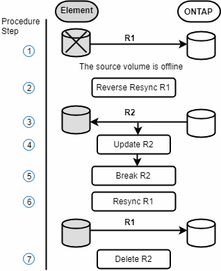
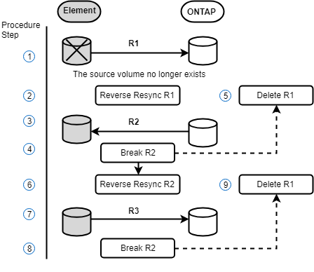

= Aprenda cómo realizar una recuperación ante fallos a Element
:allow-uri-read: 
:icons: font
:imagesdir: ../media/

[role="lead"]
Cuando se mitigó el problema en el lado primario, se debe volver a sincronizar el volumen de origen original y conmutar al software NetApp Element. Los pasos que realice varían en función de si todavía existe el volumen de origen original o si necesita realizar la conmutación tras recuperación en un volumen recién creado.

[[snapmirror-failback-scenarios]]
== Escenarios de conmutación tras recuperación de SnapMirror

La funcionalidad de recuperación ante desastres de SnapMirror se ilustra en dos escenarios de conmutación tras recuperación. Se asume que la relación original ha sido fallida (rota).

Los pasos de los procedimientos correspondientes se añaden como referencia.

NOTE: En los ejemplos que se muestran aquí, R1 = la relación original en la que el clúster que ejecuta el software NetApp Element es el volumen de origen original (elemento) y ONTAP es el volumen de destino original (ONTAP). R2 y R3 representan las relaciones inversas creadas a través de la operación de resincronización inversa.

La siguiente imagen muestra el escenario de conmutación por recuperación cuando el volumen de origen sigue existiendo:

La siguiente imagen muestra el escenario de conmutación por recuperación cuando el volumen de origen ya no existe:

[[find-more-information]]
== Obtenga más información

* xref:task_snapmirror_perform_failback_when_source_volume_exists.adoc[Realice una conmutación tras recuperación cuando el volumen de origen siga existiendo]
* xref:task_snapmirror_performing_failback_when_source_volume_no_longer_exists.adoc[Realice una conmutación tras recuperación cuando el volumen de origen ya no exista]
* xref:concept_snapmirror_failback_scenarios.adoc[Escenarios de conmutación tras recuperación de SnapMirror]

